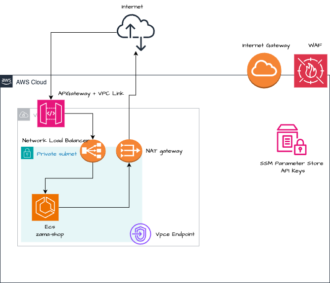

# Zama Shop Infrastructure Stack


## Table of contents

- [Zama Shop Infrastructure Stack](#zama-shop-infrastructure-stack)
  - [Table of contents](#table-of-contents)
  - [Introduction](#introduction)
    - [Directory overview](#directory-overview)
  - [Architecture](#architecture)
    - [State \& environments](#state--environments)
  - [Usage](#usage)
    - [Prerequisites](#prerequisites)
    - [Run locally](#run-locally)
    - [Smoke test](#smoke-test)
    - [Destroy](#destroy)
  - [Deploy](#deploy)
    - [From PRs](#from-prs)
    - [Manual dispatch](#manual-dispatch)
    - [Plan → apply order](#plan--apply-order)
  - [Observe](#observe)
    - [Logs - Run in separate terminals](#logs---run-in-separate-terminals)
  - [Operate](#operate)
  - [Trade-offs](#trade-offs)
  - [License](#license)

## Introduction

Infrastructure for the **Zama Pet Shop** application. This repo packages the Docker image, Terraform code, and GitHub Actions pipelines (with smoke tests) to deploy and operate the service.

It provisions:

- **Networking**: VPC, subnets, security groups  
- **App layer**: ECS tasks, ALB, WAF  
- **API Gateway** + logging + monitoring  
- **Secrets/params**: SSM data  
- **IAM/OIDC**: role assumption for GitHub Actions  

**Region:** `eu-west-3` • **Terraform:** `1.13.0`  

Workflows handle both `plan` and `apply` with automated smoke tests.

### Directory overview

```

.
├── README.md
├── .github/workflows/
│   ├── deploy-image.yml    # Build & push container image
│   ├── tf-infra-deploy.yml # Terraform plan/apply + API tests
│   └── oidc-test.yml       # OIDC role assumption test
├── docker/ 
│   ├── Dockerfile
│   └── openapi.yaml        # API config
├── terraform/
│   ├── infra/              # Main terraform stack
└   └── oidc/               # OIDC for Github Actions 

````

## Architecture


### State & environments

- Remote state backend (S3/DynamoDB) assumed  
- Environments: `dev` (only) (handled via pipeline inputs)  
- SSM Parameter Store manually added - /zama/api_key

## Usage

### Prerequisites

- Terraform 1.13.0
- AWS CLI v2 (SSO or keys configured)
- `jq`, `curl`
- Docker (optional, for local builds)

### Run locally

```bash
cd terraform/infra
terraform init
terraform plan -out=tfplan
terraform apply tfplan
````

### Smoke test

```bash
OUT=$(terraform output -json)
API=$(jq -r '.api_url.value // .api_base_url.value' <<<"$OUT")
KEY=<DUMMY API KEY OR FROM SSM PARAMTER STORE>

curl -i "${API%/}/healthz"                       # expect 200
curl -i "${API%/}/pets"                          # expect 403
curl -i -H "x-api-key: ${KEY}" "${API%/}/pets"   # expect 200
```

### Destroy

```bash
cd terraform/infra
terraform destroy -auto-approve
```

## Deploy

### From PRs

* `PR → main`: runs `terraform plan`
* `Merged → main`: runs `terraform apply`
### Manual dispatch

Actions → *Terraform Infra* → **Run workflow**

* `ref`: branch/SHA
* `mode`: `plan` or `apply`
* `environment`: `dev` or `prod`

### Plan → apply order

* `plan` job always runs first
* `apply (dev)` runs only after plan
* `apply (prod)` requires approval

## Observe

### Logs - Run in separate terminals 

```bash
# API Gateway access logs 
aws logs tail "/apigw/zama-shop/access" --since 10m --follow

# ECS/ALB logs (adjust names)
aws logs tail "/ecs/zama-shop" --since 10m --follow
```


## Operate

1. **Health** /healthz should be 200; /pets → 403 (no key) / 200 (with key)
2. **Inspect logs** check API GW access logs and ECS/ALB app logs
3. **Validate API key** 403 on `/pets` → verify SSM key and usage plan binding
4. **Recover**:

   * Roll forward: hotfix → PR → merge → pipeline applies
   * Roll back: rerun workflow with last known good commit

## Trade-offs

* **API key auth**: simple, not scalable; upgrade with Cognito/JWT
* **Single region (eu-west-3)**: cheaper, no multi-region HA
* **Prod gated approval**: safer, but slower hotfixes

## License

Copyright © Zama-shop. All rights reserved.